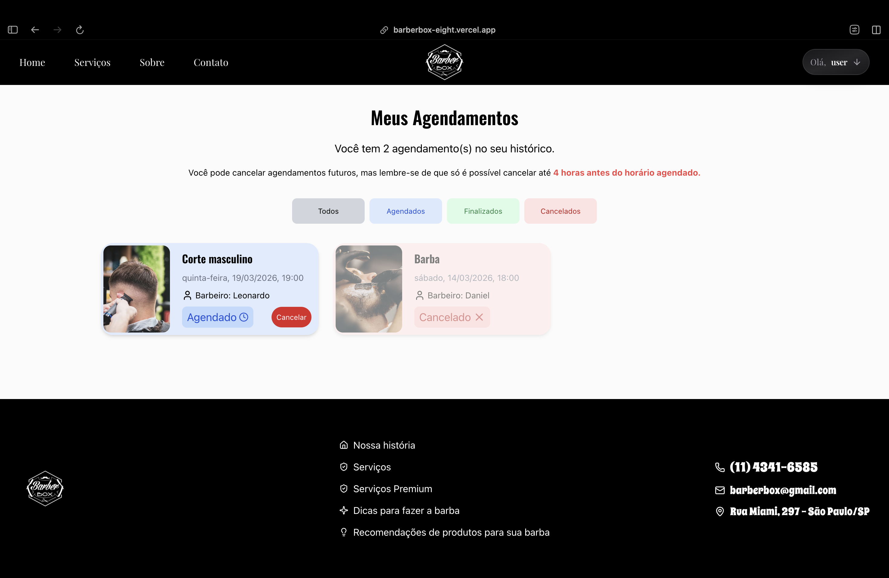

## 🎥 BarberBox
Sistema de agendamento online para barbearias, focado em arquitetura limpa, organização estrutural e experiência do usuário.

### 🛠️ Tech Stack
Front-end:
- React
- Next.js
- TypeScript
- Tailwind
- PostgreSQL
- JWT
- Git

### How to use

###1 - O usuário pode opcionalmente fazer um cadastro estando em qualquer parte do sistema 

  

###2 - Faça Login em seguida

  

###3 - Navegue até a seção de serviços ou clique no link na navbar e escolha um serviço (usando ou não um filtro)

  

###4 - Escolha um dia disponível, horário disponível e barbeiro disponível

  

###5 - Avalie o resumo e detalhes do agendamento antes de finalizar

  

###6 - O sistema exigirá login caso não tenha realizado até esse momento do fluxo

  

###7 - Após concluir, o agendamento terá sido realizado

  

### Highliths

- Proteção de rotas
- Cadastro e login de usuários
- Agendamento de horários
- Validação de conflitos de horário
- Tratamento de datas com conversão adequada
- Fluxo de agendamento com feedback
- Filtragem nos serviços

### Link
- https://barberbox-eight.vercel.app/home

### Author
#### - Anderson Miranda 

Thanks to visiting me and good coding!

  

