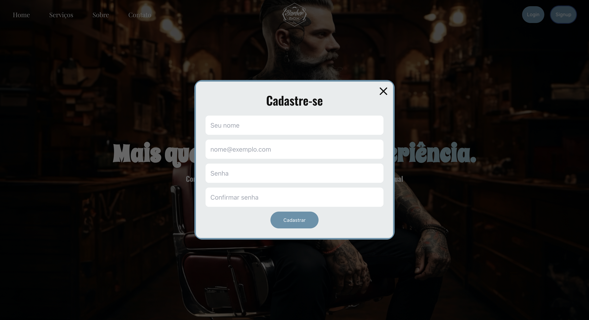
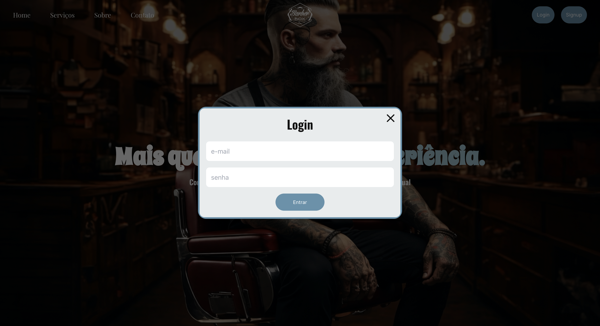
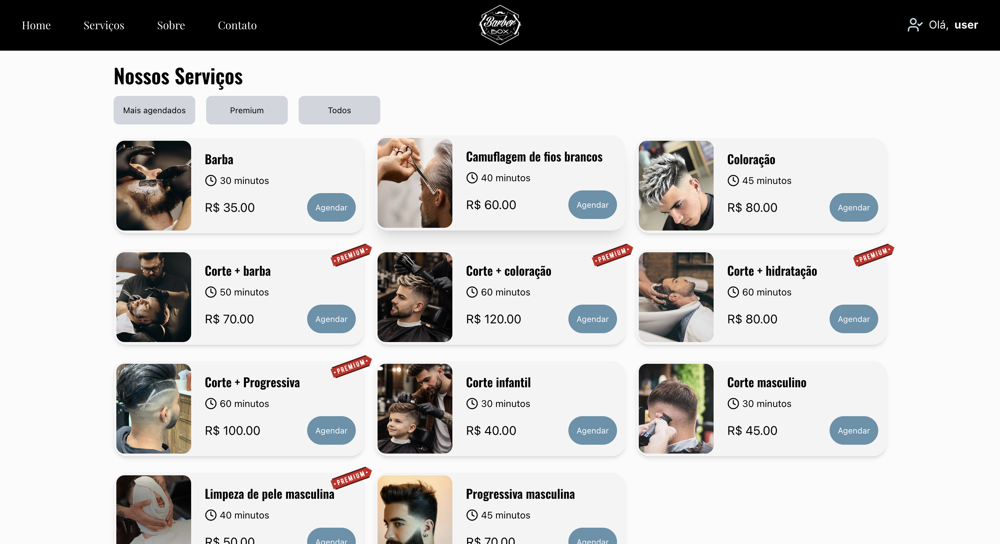
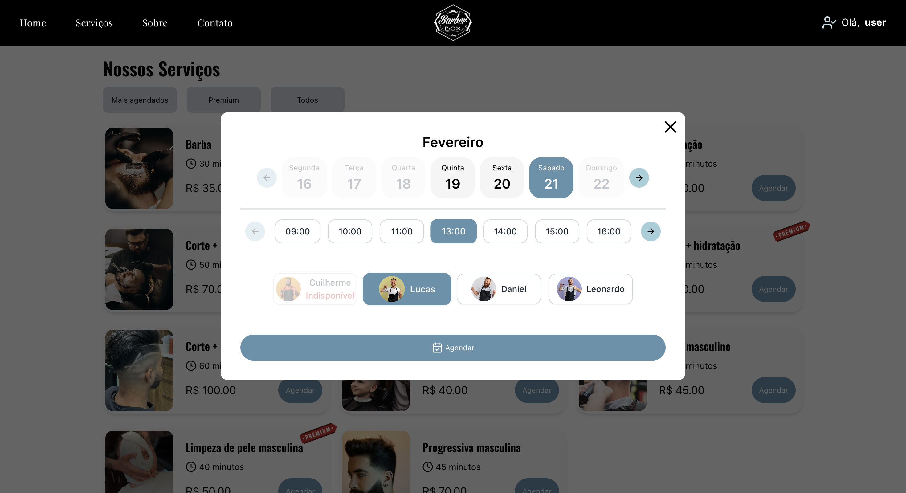
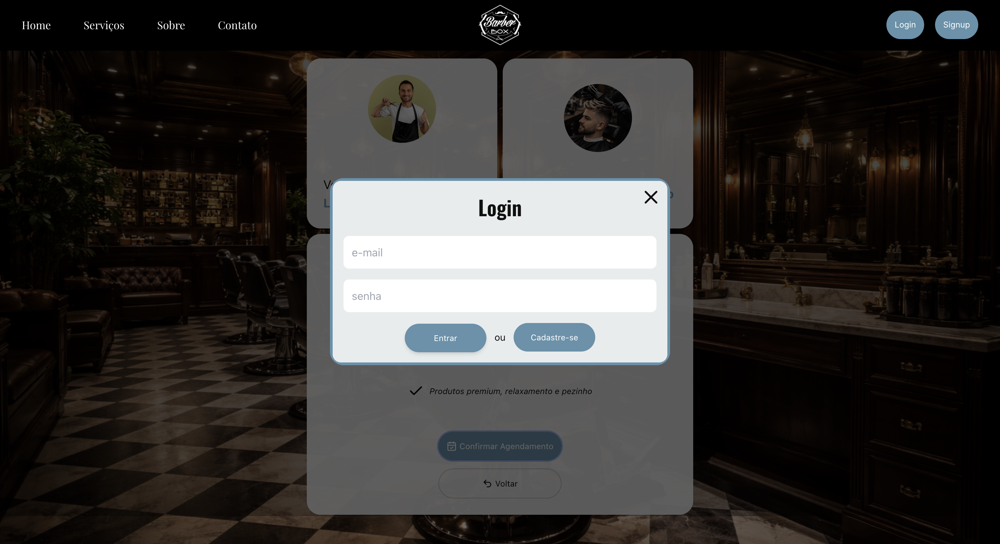

## 🎥 BarberBox
Um sistema de agendamento online para barbearias, focado em arquitetura limpa, organização estrutural e experiência do usuário.

### 🛠️ Tech Stack:
- React
- Next.js
- TypeScript
- Tailwind
- PostgreSQL
- JWT
- Git

### Como usar:

### 1 - O usuário pode opcionalmente criar uma conta a partir de qualquer parte do sistema.

  

### 2 - Então, log in

  

### 3 - Navegue até a seção de serviços ou clique no link na navbar e escolha um serviço (usando ou não um filtro).

  

### 4 - Escolha um dia, horário e barbeiro disponível

  

### 5 - Cheque o resumo e detalhes antes de prosseguir

  

### 6 - O sistema exigirá que você faça login caso ainda não tenha feito isso até esse momento do fluxo.

  

### 7 - Após concluir o processo, o agendamento será realizado com sucesso.

  

### Destaques:

- Cadastro e login de usuários
- Agendamento de horários
- Validação de conflitos de horário
- Tratamento de datas com conversão adequada
- Fluxo de agendamento com feedback
- Filtragem nos serviços

### Link:
- https://barberbox-eight.vercel.app/home

### Autor:
#### - Anderson Miranda 

Obrigado por visitar e bom código!

  

